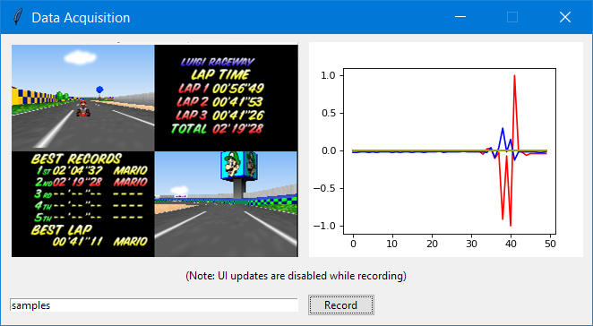
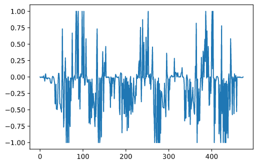
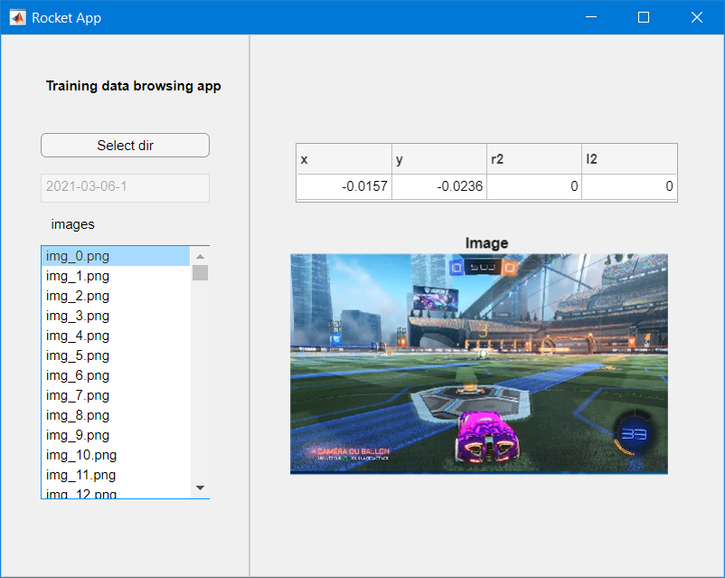
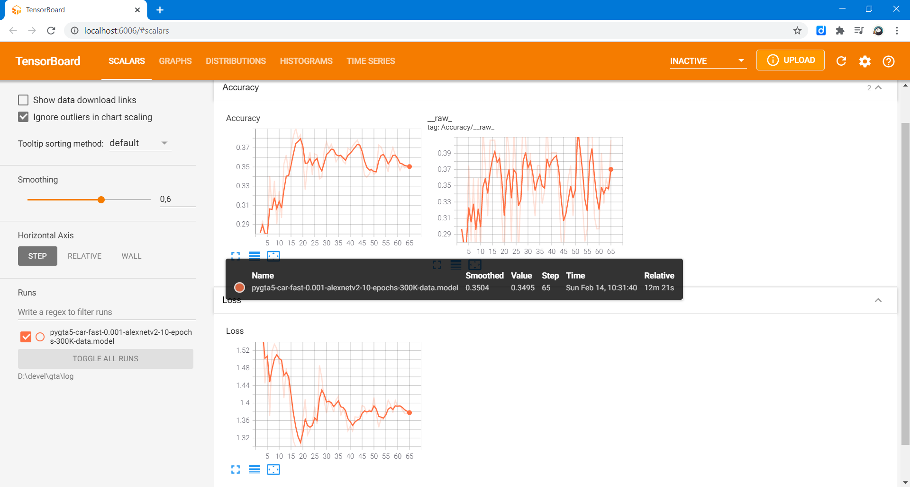
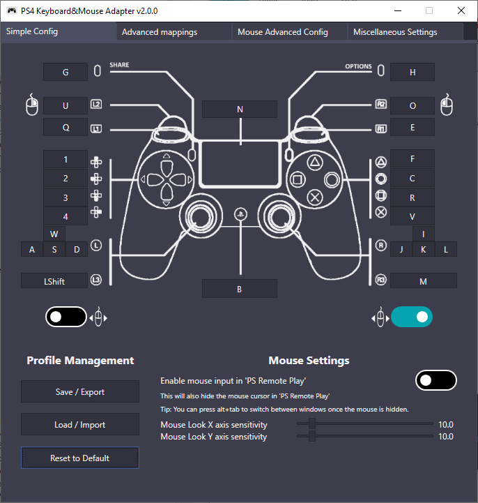

# 🚀 AI plays Rocket League ⚽ 🏎️

🤖 AI workflow: Data access - Preparation - Training - Test

*** Work in Progress... ***

(clearly >> watch dumb AI avoid the ball)


**Content:**
1. [Access data](#access)
2. [Prepare data](#prepare)
3. [Train model](#train)
4. [Test model](#test)


## 1. <a name="access"></a>Access data

Ways to access inputs:

* [PyWin32](https://pypi.org/project/pywin32/) to record keyboard
* [PyGame](pygame.org) to access [joystick](https://www.pygame.org/docs/ref/joystick.html) or [keyboard](https://www.pygame.org/docs/ref/key.html)





| |img|x|y|r|l|b|
|:--:|:--:|:--:|:--:|:--:|:--:|:--:|
|1|'samples/2021-03-01-...|-0.0157|0|0|0|0|
|2|'samples/2021-03-01-...|-0.0157|0|0|0|0|
|3|'samples/2021-03-01-...|-0.0157|0.0079|0.1289|0|0|
|4|'samples/2021-03-01-...|-0.1496|0.0709|0.9961|0|0|
|5|'samples/2021-03-01-...|0|-0.0079|0.9961|0|0|
|6|'samples/2021-03-01-...|-0.0079|-0.0236|0.9961|0|0|
|7|'samples/2021-03-01-...|0.2205|-0.0787|0.9961|0|0|
|8|'samples/2021-03-01-...|-0.0709|-0.0157|0.9961|0|0|
|9|'samples/2021-03-01-...|-0.0079|-0.0315|0.9961|0|0|
|10|'samples/2021-03-01-...|0|-0.0157|0.9961|0|0|
|11|'samples/2021-03-01-...|-0.0709|-0.0472|0.9961|0|0|
|12|'samples/2021-03-01-...|0.0079|0|0.9961|0|0|
|13|'samples/2021-03-01-...|0|0.0472|0.9961|0|0|
|14|'samples/2021-03-01-...|0.0079|0|0.9961|0|0|


## 2. <a name="prepare"></a>Prepare data

**Dataset browsing apps**




## 3. <a name="train"></a>Train model 

**Tensorflow on NVIDIA GeFOrce GTX 960M**



## 4. <a name="test"></a>Test model

| |img|x|y|r2|l2|r1|
|:--:|:--:|:--:|:--:|:--:|:--:|:--:|
|1|'samples/2021-03-06-1/img_0.png|-0.015747|-0.023621|0.000000|0.0|0|


```python
>>> joystick = model.predict(vec, batch_size=1)[0]
>>> print(joystick[0])
-0.007983289
```
[Map the command to the Keyboard](https://github.com/starshinata/PS4-Keyboard-and-Mouse-Adapter)




## Sources
Based on:
* [TensorKart](https://github.com/kevinhughes27/TensorKart)
* [marioKartAI](https://github.com/slevin48/marioKartAI): 🤖AI plays Mario Kart 🏎️
* [gta](https://github.com/slevin48/gta): 🤖 Train a self-driving car in GTA V 🚗
* [AI-workflow](https://github.com/slevin48/AI-workflow): 🤖 AI workflow: Data access & Preparation + Model training & Test
